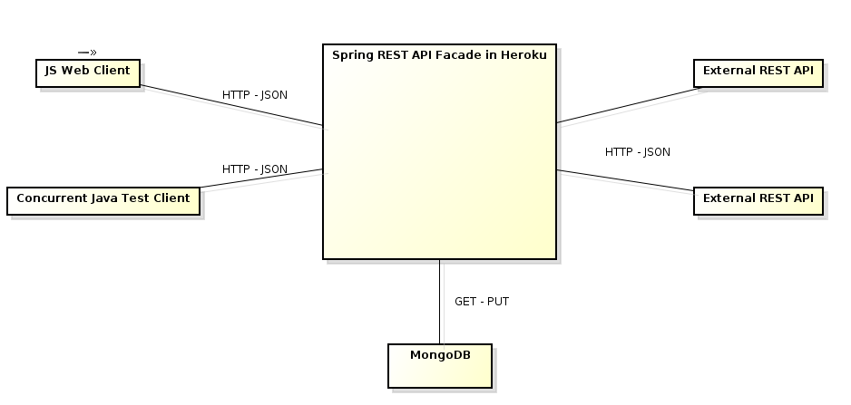

# Laboratorio Bases de Datos No-SQL
## Arquitecturas de Software - ARSW
## Escuela Colombiana de Ingeniería

- Daniela González
- [Link de heroku](https://arsw-lab7.herokuapp.com/)

## Descripción arquitectura

La arquitectura esta compuesta por un cliente pesado en Javascript, un controlador Spring para aceptar multiples peticiones HTTP realizadas desde un cliente WEB, el controlador tiene inyectado un servicio que se encarga de consultar en un API externo (https://www.alphavantage.co/documentation) el mercado de valores de las acciones negociadas en la Bolsa mediante un identificador y el histórico de la valoración (intra-día, diaria, semanal o mensual). El sistema busca primero una respuesta a la consulta en la base de datos y si no tiene respuesta realiza la consulta al API externo.

## Diseño

